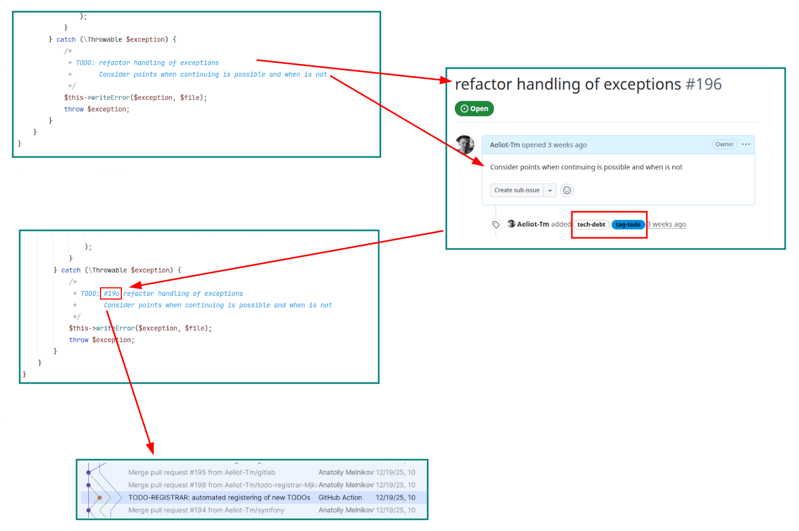

[](https://packagist.org/packages/aeliot/todo-registrar)
[](https://github.com/Aeliot-Tm/todo-registrar/actions/workflows/automated_testing.yml?query=branch%3Amain)
[](https://github.com/Aeliot-Tm/todo-registrar/actions/workflows/security-audit.yaml?query=branch%3Amain)
[](LICENSE)

It takes TODO/FIXME and other comments from your php-code and register them as issues in Issue Trackers like
JIRA. With all necessary labels, linked issues and so on.

## Motivation

Time to time developers left notes in code to not forget to do something. And they forget to do it.
One of the main reason is that it is difficult to manage them.

Why do developers left comment in code instead of registering of issues? It is convenient. You don't need to deal
with UI of Issue Tracker and to fill lots of field. And lots of times to register each issue. It takes time.
The second reason, comment in code permit to mark exact place which have to be modified. And many other reasons.
No matter why they do it. They do it and leave this comments for years.

Somebody have to manage it.

So, we need in tool which will be responsible for registering of issues and save time of developers. After that
you can use all power of management to plan solving of lacks of your code.

This script do it for you. It registers issues with all necessary params. Then injects IDs/Keys of created issues
into comment in code. This prevents creating of issues twice and injected marks helps to find proper places in code quickly.

## How it works

1. Detect TODO in comment.
2. Create issue in issue tracker ([list of supported](#supported-issue-trackers)).
3. Inject number of ticket into TODO-comment.



## Using

**Basic using:**
1. Create [configuration file](docs/config/general_config.md).
2. Call shell script with necessary [command line options](#command-line-options).
3. Commit updated files. You can config your pipeline/job on CI which commits updates.

**There are prepared several ways of using:**
1. Using of GitHub Action: [TODO Registrar Action](https://github.com/marketplace/actions/todo-registrar).
2. [Using of Docker Container](#using-of-docker-container).
3. [Using of PHAR file](#using-of-phar-file).
4. [Using of Composer Package](#using-of-composer-package).

I recommend [TODO Registrar Action](https://github.com/marketplace/actions/todo-registrar) for repositories hosted on GitHub.

The next recommendation is using of Docker container. It provides fully isolated solution.
There is no matter which version of PHP installed in yous system
and which components required by Composer (no dependency hell).

The next one is using of single `PHAR` file. It frees you from dependency hell,
but you have to pay attention to version of PHP installed in you system and its modules.
However, this may be more familiar for you.

The last one is using of Composer package. The most common, but less flexible method.

### Using of Docker Container

You can use the pre-built Docker image from GitHub Container Registry:

1. Pull the latest image
   ```shell
   docker pull ghcr.io/aeliot-tm/todo-registrar:latest
   ```
2. Run script with necessary [command line options](#command-line-options)
   ```shell
   docker run --rm -it \
     -v $(pwd):/code \
     ghcr.io/aeliot-tm/todo-registrar:latest <options>
   ```

**Important notes:**
- Mount your project directory to `/code` (this is the working directory inside the container).
- Use `-it` flags for interactive mode if you need to see real-time output.
- The container uses unbuffered output, so messages will appear in real-time.
- Pass necessary environment variables instructions `-e $VAR_NAME`
  or by the creating of `.env` file with necessary variables in the root of project.
- PHAR file inside the container (`/usr/local/bin/todo-registrar`). You can rely on it.

### Using of PHAR file

1. Download PHAR directly to root directory
   ```shell
   wget -O todo-registrar.phar "https://github.com/Aeliot-Tm/todo-registrar/releases/latest/download/todo-registrar.phar"
   ```
2. Call script with necessary [command line options](#command-line-options)
   ```shell
   php todo-registrar.phar <options>
   ```

Additional instructions how to verify package read [here](docs/installation/phar_directly.md).

**Alternatively**, you can install `phar` file by [PHIVE](https://phar.io/)
1. Install phar file (by default it will be installed in directory `tools` in the root of project without extension)
   ```shell
   phive install todo-registrar
   ```
2. Call script with necessary [command line options](#command-line-options)
   ```shell
   tools/todo-registrar <options>
   ```

Additional instructions read [here](docs/installation/phive.md).

### Using of Composer Package

1. Require the package as development dependency
   ```shell
   composer require --dev aeliot/todo-registrar
   ```
2. Call script with necessary [command line options](#command-line-options)
   ```shell
   vendor/bin/todo-registrar <options>
   ```

### Command Line Options

First of all, pay attention to **available options:**

| Long Form | Short From | Description |
|---|---|---|
| `--config=/path/to/config` | `-c /path/to/config` | Path to [configuration file](docs/config/general_config.md) when it is not in default place |
| | `-q`, `-v`, `-vv`, `-vvv` | Verbosity levels. The command uses [Symfony Console verbosity levels](https://symfony.com/doc/7.4/console/verbosity.html) |

**NOTE:** You can pass a special value`--config=STDIN` then [script obtains YAML from STDIN](docs/config/general_config_yaml.md#loading-from-stdin).

### Integration on CI

The main idea is monitoring of new TODOs on single branch of repository
to avoid creation of duplicated issues by competing processes and avoid merge conflicts.

The branch should be quite stable (without development directly in it. At the same time,
it should be as close to development as possible for earlier catching of tech-debt.
Soon of all, it is called `development`, but `main`/`master` is useful too.

Configure you integration depending on used git-server:

1. GitHub Action (use [TODO Registrar Action](https://github.com/marketplace/actions/todo-registrar))
2. [Configure GitLab CI](docs/GitlLab/integration_on_ci.md)

## Configuration

First of all you have to create [general config](docs/config/general_config.md).

Additionally, script supports [inline configuration](docs/inline_config.md) - nice feature for the fine-tuning
of each created issue. It helps flexibly configure different aspects of created issues
like labels, components, relations to other issues and so on. So, it becomes mighty tool. 😊

### Supported tags

It detects `TODO` and `FIXME` by default. At the same time, you can config your custom set of tags in config file.
Whey will be detected case insensitively.

## Supported formats of comments:

It detects TODO-tags in:
- single-line comments started with both `//` and `#` symbols
- multiple-line comments `/* ... */`
- phpDoc `/** ... **/`.

Comments can be formatted differently:
```php
// TODO: comment summary
// TODO comment summary
// TODO@assigne: comment summary

/**
 * TODO: XX-001 comment summary
 *       with some complex description
 */
```

And others. [See all supported formats](docs/supported_patters_of_comments.md).

## Supported Issue Trackers

Currently, todo-registrar supports the following issue trackers:

| Issue Tracker | Description |
|---|---|
| GitHub issues | Supported via API tokens. See [description of configuration](docs/registrar/GitHub/config.md) |
| [GitLab](https://about.gitlab.com/) | Supported via API tokens (HTTP Token or OAuth). See [description of configuration](docs/registrar/GitLab/config.md) |
| [JIRA](https://www.atlassian.com/software/jira) | Supported via API tokens. See [description of configuration](docs/registrar/JIRA/config.md) |
| [Redmine](https://www.redmine.org/) | Supported via API keys or Basic Auth. See [description of configuration](docs/registrar/Redmine/config.md) |
| [Yandex Tracker](https://tracker.yandex.com/) | Supported via OAuth tokens. See [description of configuration](docs/registrar/YandexTracker/config.md) |
| Any custom Issue Tracker | Read about [customization](docs/customization.md) |

## Articles

RU: https://habr.com/ru/articles/832994/

## Contributing

Read [contributing instructions](CONTRIBUTING.md).
