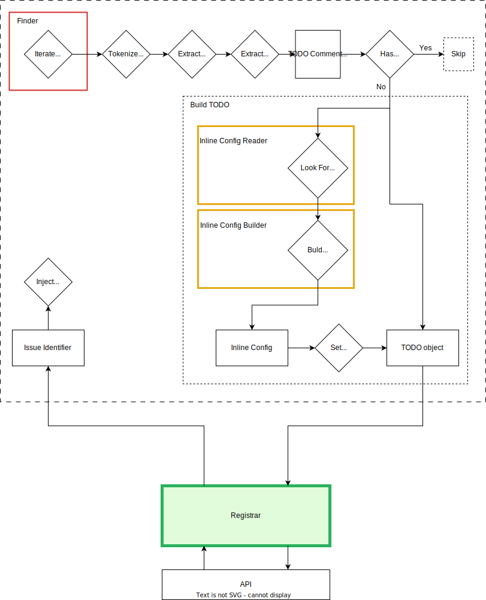

# Customization

If you want to get support for your own issue tracking system or create your own workflow plugins, you can do so.

Look no the **processing schema**:



## Implementation of Registrar

First of all, you may want to implement **Registrar** for your custom API.
It has to implement interface `Aeliot\TodoRegistrarContracts\RegistrarInterface`

It accepts interface of TODO object (`Aeliot\TodoRegistrarContracts\TodoInterface`) and returns identifier (`string`) of created issue.
In short, returned identifier have to match one of patterns:
- `/\#\d++/`
- `/[A-Z0-9]++-\d++/`

For more details see method `getTicketKeyRegExpressions` of [Detector](../src/Service/Tag/Detector.php)

TODO object always contains example of [inline config](inline_config.md) regardless of whether it is found or not.

### Registrar builder

Implement `Aeliot\TodoRegistrarContracts\RegistrarFactoryInterface` to provide you custom registrar.
It accepts array of registrar config which have to be passed via [general config](#general-config).

## Building of Inline Config

[Inline config](inline_config.md) is powerful feature for fine-tuning of created issues.
If you want to use your custom format of inline configs and/or need in custom object of your Registrar
then pay attention to 'Inline Config Reader' (`Aeliot\TodoRegistrarContracts\InlineConfigReaderInterface`)
and 'Inline Config Builder' (`Aeliot\TodoRegistrarContracts\InlineConfigFactoryInterface`).

### Inline Config Reader

'Inline Config Reader' (`Aeliot\TodoRegistrarContracts\InlineConfigReaderInterface`) accepts description of issue
and have to return an array with inline config data. If nothing detected then it have to return an empty array.

### Inline Config Builder

'Inline Config Builder' (`Aeliot\TodoRegistrarContracts\InlineConfigFactoryInterface`) accepts array with inline config data
and create object of inline config (`Aeliot\TodoRegistrarContracts\InlineConfigInterface`) even for an empty array.

## Finder

Normally, you have not to implement finer. Project uses powerful [Symfony Finder](https://symfony.com/doc/current/components/finder.html).
Nevertheless, you may implement your own. Just implement interface `Aeliot\TodoRegistrarContracts\FinderInterface`.

## General Config

Finally, have to pass all that stuff as [global config](config/global_config.md).
If you decided implement [PHP version of global config](config/global_config_php.md)
then implement `Aeliot\TodoRegistrarContracts\GeneralConfigInterface`.

## Contracts package

Use package with contracts (interfaces):
```shell
composer require aeliot/todo-registrar-contracts
```

---

**NOTE:** Don't rely on inner (`@internal`) classes and methods. Their support is not guaranteed.
They can be changed, moved or deleted rapidly without any announcement.
